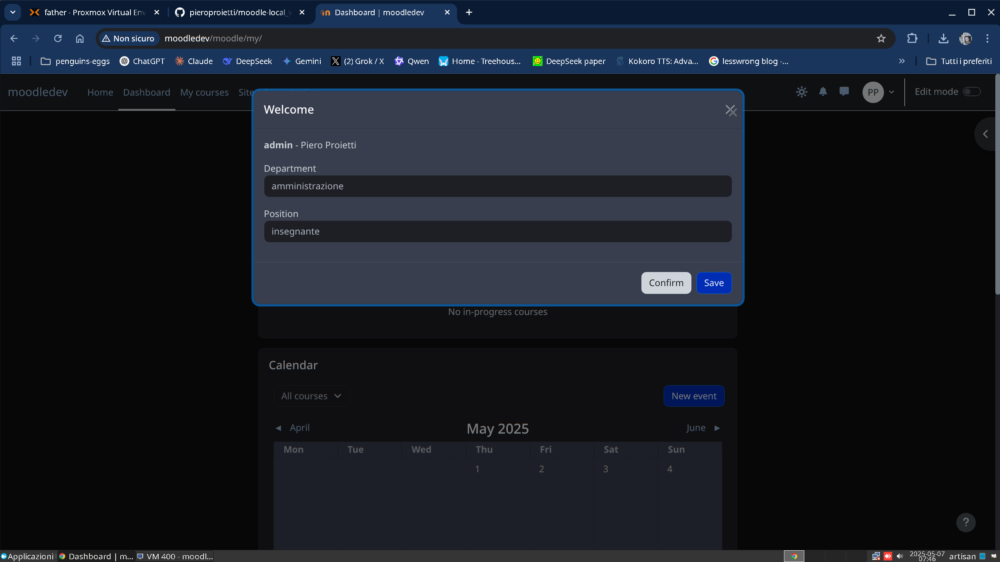

# README

Creare un plugin di tipo `local` denominato `local_confirm` per moodle 5.0.0 con una finestra modale 
che si apre al momento del login e DEVE essere accettato o modificato dall'utente prima di poter 
proseguire.

Il modulo JavaScript dovrebbe usare il formato `ES2015+` che viene trnspilato in formato CommonJs.

Nella finestra dovranno essere mostrati:
* user
* nome
* cognome
* dipartimento
* posizione

Ci dovrebbero, infine, essere tre bottoni: Conferma, Modifica, Salva

I campi: dipartimento e posizione, dovrebbero essere modificati attraverso 
dei selectBox.


```
dipartimenti = ['amministrazione', 'istruzione', 'altro']
posizioni = ['insegnante', 'bidello', 'studente']
```

```
+------------------ confirm ------------------+
| [username] [cognome] [nome]                 |
| dipartimento _____________________________^ |
| posizione    _____________________________^ |
|                                             |
|               [Conferma] [Modifice] [Salva] |
+---------------------------------------------+
```



# struttura
```
local_confirm/
├── amd/
│   ├── src/
│   │   └── modal.js
│   └── build/
├── lang/
│   └── en/
│       └── local_welcome.php
├── lib.php
├── settings.php
├── version.php
└── db/
    └── access.php
```

# installazione

```
cd /var/www/moodle/local/
git clone https://github.com/pieroproietti/moodle-local_confirm confirm
ln -s /var/www/html/moodle/local/confirm $HOME/moodle-local_confirm
```
# Funzionamento

Quando un utente effettua il login, verrà mostrata una finestra modale con le sue informazioni.

L'utente potrà modificare il dipartimento e la posizione tramite menu a discesa.

Per proseguire, l'utente deve fare clic su "Save".

Le modifiche verranno salvate nel profilo dell'utente.

La finestra modale non può essere chiusa senza salvare le modifiche.

# Link
JavaScript in Moodle is structured into ES2015 modules which are transpiled into the CommonJS format.

* [javascript](https://moodledev.io/docs/5.0/guides/javascript)
* [hooks](https://moodledev.io/docs/4.4/apis/core/hooks)
* [moodle-live-iso](https://github.com/pieroproietti/moodle-iso-live)